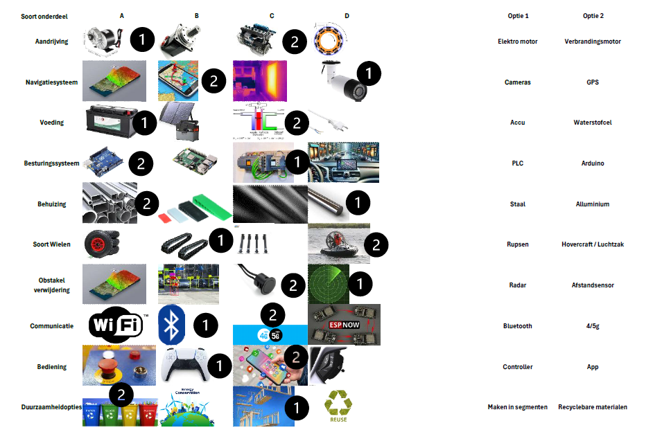

# Ontwerpfase

!!! info "Wat is de ontwerpfase"
    In deze fase wordt het ontwerp van het project ontwikkeld. Het projectteam werkt aan het creëren van technische oplossingen, prototypes, schematische tekeningen of simulaties, afhankelijk van de aard van het project. Er wordt rekening gehouden met technische specificaties, regelgeving en andere vereisten.

## Functioneel ontwerp
{ align=left }

## Mindmap
{ align=left }

## Ideeschetsen
Getekend door Casper Oudman

## Morfologische kaart
{ align=left }

