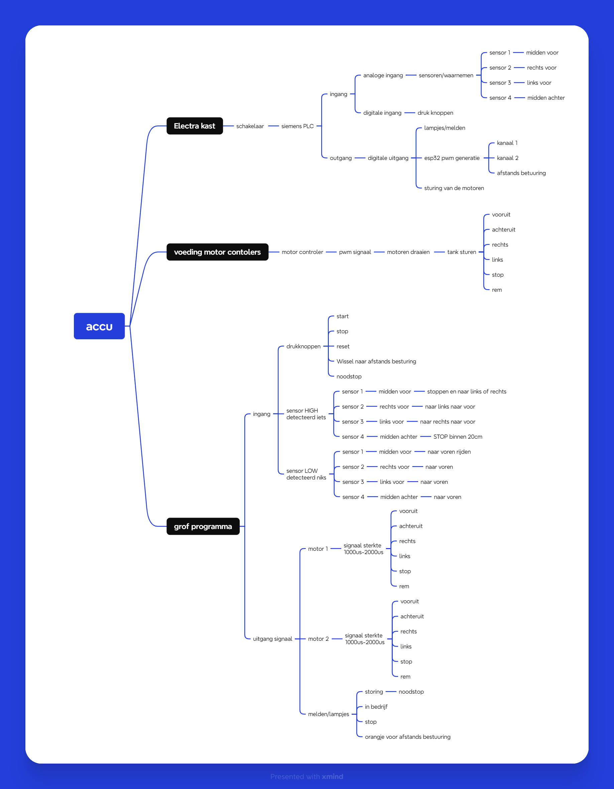
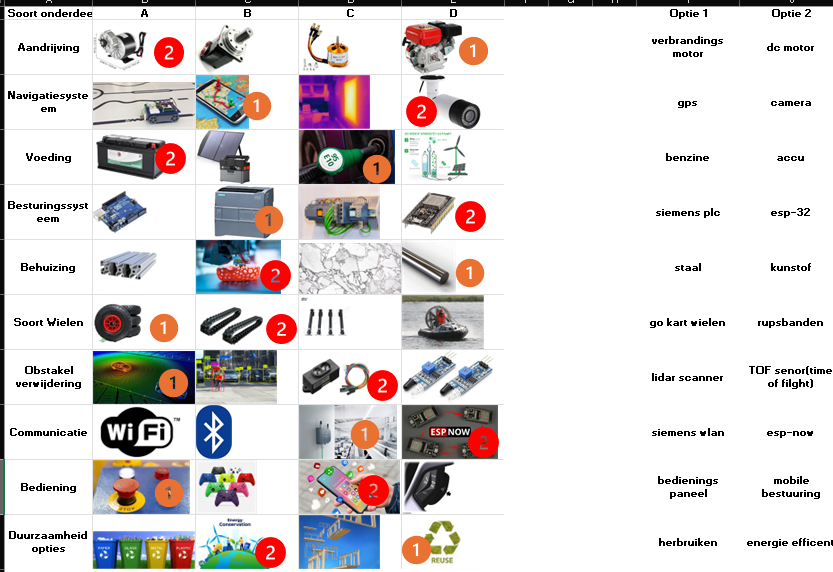
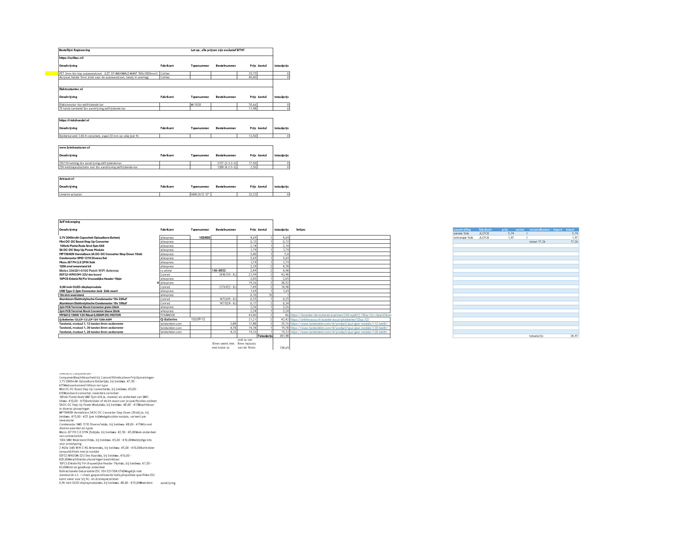

# Ontwerpfase

!!! info "Wat is de ontwerpfase"
    In deze fase wordt het ontwerp van het project ontwikkeld. Het projectteam werkt aan het creëren van technische oplossingen, prototypes, schematische tekeningen of simulaties, afhankelijk van de aard van het project. Er wordt rekening gehouden met technische specificaties, regelgeving en andere vereisten.

## Functioneel ontwerp
{ align=left }

## Mindmap
{ align=left }

## Ideeschetsen

Getekend door Jayden Strikkers

## Morfologische kaart
{ align=left }

## Wet & Regelgeving
!!! info "Waarom is wet- en regelgeving belangrijk?"
    Wet- en regelgeving waarborgt de veiligheid, kwaliteit en duurzaamheid van het product.
    Hier worden de relevante normen en milieueisen besproken.

{ align=left }
{ align=left }
{ align=left }

## Voorlopige bestellijst & Kostenberekening
{ align=left }

## Keuze uit Ideeen
Wij hebben als groepje gekozen om met de volgende onderdelen een tank te gaan maken.

- Aandrijving -> Rups
- Motoren -> DC Brush motoren
- Frame -> Plaatwerk
- Navigatie systeem -> Afstandssensoren
- Voeding -> Accu
- Materiaal v/d behuizing -> Alluminium
- Bediening -> Afstandsbesturing & Autonoom
- Besturingssysteem -> PLC

!!! info "Beredenering"
    Deze keuzes hebben wij gemaakt omdat wij graag een tank willen maken, deze tank hebben wij bedacht dat hij voldoet aan alle specifiecaties van de opdrachtgever, hij past binnen de afmetingen en heeft een draaicirkel van 0m.

    Wij hebben dit idee met Eberlei en Brookman besproken, en hun waren beide enthausiast over ons plan en steunen dit idee. 
    Samen met hun overleggen wij over de onderdelen die wij bestellen gaan en hoe we dit werkend gaan maken.